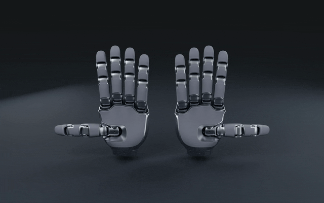
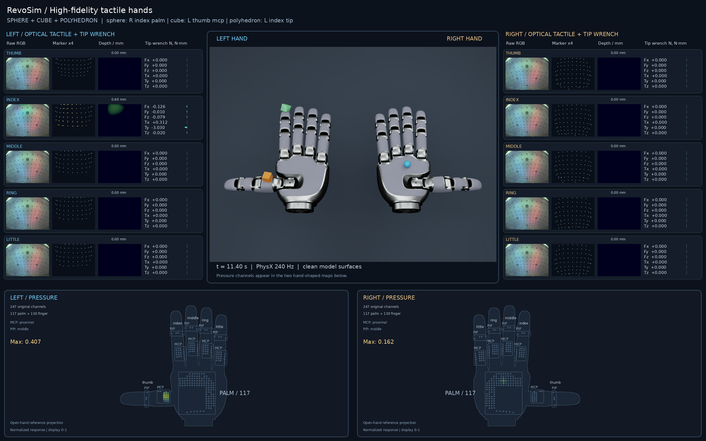

<h1 align="center">RevoSim: Scalable Multimodal Tactile Simulation for Dexterous Manipulation</h1>

<p align="center">
  <a href="https://davidlxu.github.io/RevoSim-web/">Project Website</a> ·
  <a href="README.md">中文</a> ·
  <strong>English</strong>
</p>

RevoSim integrates visual appearance, joint kinematics, dynamics, and multimodal tactile sensing in a single two-hand model for sim-to-real work. The orbiting finger-dance showcase highlights the original materials' gloss and color, along with dynamics-driven finger waves, rapid gesture transitions, and lateral V-sign movements. The contact demo below shows responses across the tactile regions.

<p align="center">
  <a href="docs/videos/revosim-orbit-60fps.mp4">
    
  </a>
  <br>
  <a href="docs/videos/revosim-orbit-60fps.mp4">Watch the finger-dance video (60 fps, 15 seconds)</a>
</p>

Each hand has 21 revolute joints, 247 piezoresistive channels, and five fingertip visuotactile regions. In the contact demo, both palms face upward. Objects can be controlled through the Python API or keyboard while reading raw simulated RGB, marker displacement, depth, six-axis contact wrench, and piezoresistive responses.



[Watch the three-object parallel tactile demo (60 fps, approximately 19 seconds)](docs/videos/revosim-demo-60fps.mp4)

A sphere, a cube, and an irregular convex polyhedron press and slide across both hands simultaneously. Random changes in position and direction cover all ten fingertips and every proximal, middle-phalanx, and palm piezoresistive region in approximately 19 seconds.

## Environment

The target environment is **Linux, Python 3.11, Isaac Sim 5.1.0, Isaac Lab v2.3.2, and CUDA PyTorch 2.7.0**. An NVIDIA RTX GPU and driver supported by Isaac Sim are required. Runtime validation used Ubuntu 24.04 and an RTX 5090 with 32 GB VRAM.

Use a separate environment to avoid modifying an existing Isaac Lab installation:

```bash
conda create -n revosim python=3.11 -y
conda activate revosim
python -m pip install --upgrade pip
python -m pip install torch==2.7.0 torchvision==0.22.0 --index-url https://download.pytorch.org/whl/cu128
python -m pip install 'isaacsim[all,extscache]==5.1.0' --extra-index-url https://pypi.nvidia.com

git clone --branch v2.3.2 --depth 1 https://github.com/isaac-sim/IsaacLab.git ../IsaacLab
python -m pip install -e ../IsaacLab/source/isaaclab

# Run from this repository's root. All hand models and sensor files are bundled.
python -m pip install -e '.[test]'
python tools/doctor.py
```

RevoSim includes a minimal Kit launch configuration that uses only Isaac Lab core. It does not require `isaaclab_tasks`, `isaaclab_assets`, RL, or Mimic extensions. The pinned versions avoid changes in Isaac Sim/Python requirements on the default branch. Isaac Lab v2.3.2 corresponds to commit `37ddf626871758333d6ed89cf64ad702aef127d0`.

For base installation instructions, see the [NVIDIA Isaac Sim 5.1 documentation](https://docs.isaacsim.omniverse.nvidia.com/5.1.0/installation/install_python.html) and [Isaac Lab v2.3.2 documentation](https://isaac-sim.github.io/IsaacLab/v2.3.2/source/setup/installation/pip_installation.html). If you already have a compatible environment, install this project without downloading Isaac Sim again.

## Run the demos

```bash
# Minimal data access: press the left index fingertip with a sphere and print sensor arrays.
python examples/read_sensors.py --headless --device cuda:0

# Three objects press and slide simultaneously; a fixed seed reproduces full tactile coverage.
python examples/parallel_demo.py --headless --device cuda:0 --fps 60 --seed 42 --output outputs/parallel

# Longer sequential-object demo, including ballistic transfers across the palms.
python examples/slide_demo.py --headless --device cuda:0 --shape all --fps 30 --output outputs/demo

# Record a single object type; supports 15, 30, or 60 fps.
python examples/slide_demo.py --headless --device cuda:0 --shape sphere --fps 60 --output outputs/sphere

# Interactive visualization: open Isaac Sim and the ten-finger tactile dashboard.
python examples/interactive.py --device cuda:0 --shape sphere --output outputs/interactive

# Simulate and render a 15-second orbit with off-beat finger waves, gesture changes, V-sign sway, and alternating finger taps.
python examples/finger_dance.py --headless --device cuda:0 --output outputs/finger-dance

# Export a looping 30 fps GIF; optionally install gifsicle for further compression.
python tools/make_orbit_gif.py outputs/finger-dance/revosim-finger-dance-60fps.mp4 outputs/finger-dance/revosim-finger-dance.gif
```

Keyboard controls: `W/S` move forward/backward, `A/D` left/right, and `Q/E` up/down. Space releases the object, `R` resets it above the left index fingertip and reconnects the drive, and `Esc` exits. The keyboard moves the target of a virtual spring attached to the object; PhysX solves the object's motion and contacts.

Video frame rate describes simulation sampling and playback. Offline rendering is not guaranteed to run at a real-time 60 fps.

The longer sequential-object demo automatically approaches, presses, slides back and forth, releases, and performs ballistic transfers across the palms. The initial launch velocity represents an external impulse; only gravity and contact act during flight. This is not an autonomous grasping policy, and objects are not secretly attached to fingers. Objects are not teleported each frame, except for explicit resets.

In the longer demo, `--quick` checks only the left/right index fingertips and palms. It is intended for installation checks, not full ten-finger coverage validation. `--no-data` omits full lossless RGB/depth recordings; the parallel demo still saves `telemetry.npz` for coverage and contact checks. `--max-frames` truncates development runs, and the report explicitly marks them as incomplete.

## Dashboard and data

The simulation view is centered. RGB, marker-field, depth-map, and six-axis contact force/torque panels for the five left fingertips appear on the left, and those for the right hand appear on the right. Two piezoresistive views at the bottom retain the full hand silhouettes, lighting up palm and MCP/PIP regions. Outlines and labels identify each sensor group.

The output directory contains:

| File | Contents |
|---|---|
| `dashboard.mp4` | Synchronized views of both hands and all ten fingertip sensor panels |
| `observations.h5` | Raw floating-point RGB, depth, markers, pressure, wrench, poses, and timestamps, with lossless gzip compression |
| `calibration.npz` | Original marker order, validity masks, camera coordinates, and registration resources |
| `sensor_layout.json` | Runtime tactile sampling positions, normals, owning links, joint names, and angle limits |
| `metadata.json` | Units, coordinate systems, left/right and finger ordering, and data ranges |
| `frames.jsonl` | Per-frame time and demonstration phase |
| `physics.json` | Collision geometry added at runtime and records of missing-mass regularization |
| `report.json` | Coverage, per-channel peaks, and release state |
| `telemetry.npz` | Per-frame wrench, pressure, marker and depth peaks, contact flags, object poses, and optical target indices for the parallel demo |

The first array dimension follows `left, right`. The second dimension, where it indexes fingers, follows `thumb, index, middle, ring, little`:

| Field | Shape per frame | Meaning |
|---|---|---|
| `rgb` | `[2,5,3,240,320]` | Raw simulated visuotactile RGB, float32, range 0–1 |
| `depth` | `[2,5,240,320]` | Contact indentation depth in meters |
| `marker` | `[2,5,100,3]` | Displacement in the fingertip soft-pad link's local coordinates, in meters; use with the validity mask |
| `wrench` | `[2,5,6]` | Resultant contact force and torque between the fingertip soft pad and target object: `Fx,Fy,Fz,Tx,Ty,Tz`, in N and N·m |
| `contact` | `[2,5]` | Whether the fingertip soft pad and target have normal contact |
| `pressure` | `[2,247]` | Nonnegative normalized response after spatial diffusion; may exceed 1 and is not measured in Pa, N, or resistance |
| `pad_pose` | `[2,5,7]` | Fingertip soft-pad world position and wxyz quaternion |
| `joint_pos` | `[2,21]` | Measured joint angles in radians |
| `object_pose` | `[7]` | World pose of the first target object: position and wxyz quaternion |
| `object_poses` | `[number of objects,7]` | World poses of all target objects |
| `optical_object_index` | `[2,5]` | Per-fingertip optical contact target index in multi-object mode; -1 when there is no indentation |

The six-axis wrench includes only normal and frictional forces between the `DIP_rubber_link` soft pad and the target object. It does not aggregate contacts on proximal/middle phalanges or rigid shells. Torque is referenced to the `DIP_rubber_link` origin, and the wrench is expressed in that link's local frame. The dashboard converts N·m to N·mm for readability; raw data always uses N·m.

Piezoresistive channel order: middle MCP 23 / PIP 4, index 23 / 4, ring 23 / 4, little 23 / 4, thumb 18 / 4, and palm 117. Use `revosim.resources.pressure_regions()` to retrieve the slices.

## Python API

Start the Isaac application before creating a `World`:

```python
import argparse
from isaaclab.app import AppLauncher
from revosim.launch import configure

parser = argparse.ArgumentParser()
AppLauncher.add_app_launcher_args(parser)
app = AppLauncher(configure(parser.parse_args()), multi_gpu=False).app
try:
    from revosim.world import World
    world = World(shape="sphere", device="cuda:0")
    point, normal = world.surface_point("left", "index", "tip")
    world.reset_object(point + normal * 0.025)
    world.drive_object(point + normal * 0.005)
    for _ in range(120):
        world.step()               # Four physics steps at 240 Hz by default.
        data = world.observe()     # Returned arrays own their data and can be saved directly.
        print(data["wrench"][0, 1])
finally:
    app.close()
```

`world.sensor_layout()` returns sensor sampling positions, coordinate systems, and joint ordering in a directly JSON-serializable structure.

`world.set_joints(side, {joint_name: radians})` sets joint targets, and `world.release_object()` disconnects the probe drive. `World(shape=("sphere", "cube", "polyhedron"), hand_spacing=0.20)` creates a three-object scene; `drive_object(position, object_name="cube")` controls a specific target. In multi-object mode, raw piezoresistive responses are combined by a pointwise maximum before a single spatial diffusion step. Each fingertip's RGB, marker, and depth signals come from the same contact target. The current optical backend supports at most one target in contact with each fingertip at a time. Overlapping targets raise an error rather than producing a synthetic multi-target optical image.

## Project structure

```text
src/revosim/       World API, scenes, dashboard, recording, and minimal launcher
  tactile/        Piezoresistive, depth, HydroShear, and Taxim backends
  assets/         Left/right hand USDs, PBR textures, tactile resources, and source hashes
examples/         Sensor access, three-object demos, and keyboard interaction
tools/            Environment checks, data validation, and diagnostics
tests/            Channel contracts, coordinate registration, wrench, and independence tests
```

See `THIRD_PARTY_NOTICES.md` and the individual asset directories for third-party licenses and file notices.

## Citation

To cite this project, use the following BibTeX entry:

```bibtex
@misc{zhang2026revosim,
  title = {{RevoSim}: Scalable Multimodal Tactile Simulation for Dexterous Manipulation},
  author = {Zhang, Ke and Xu, Lixin and Wang, Ziyi and Dong, Xiyue and Tan, Jie and Li, Chuanyu and Xu, Renjing},
  year = {2026},
  url = {https://davidlxu.github.io/RevoSim-web/}
}
```
